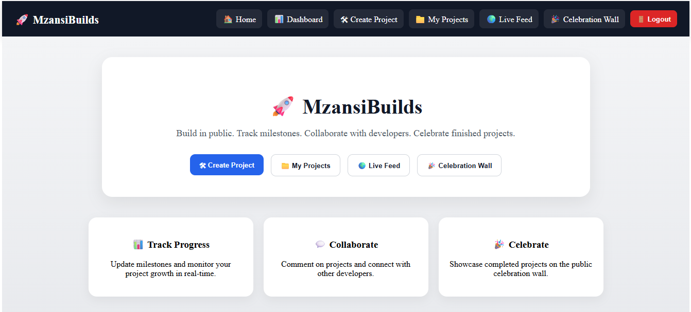
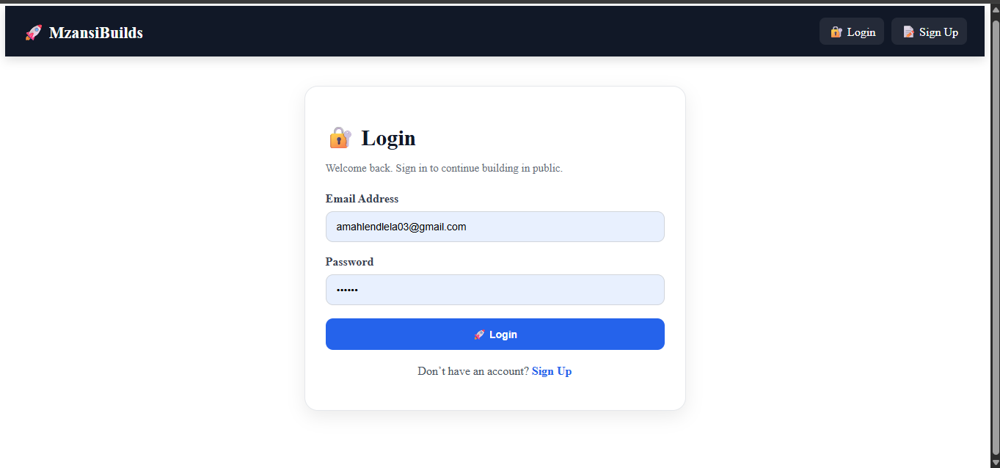
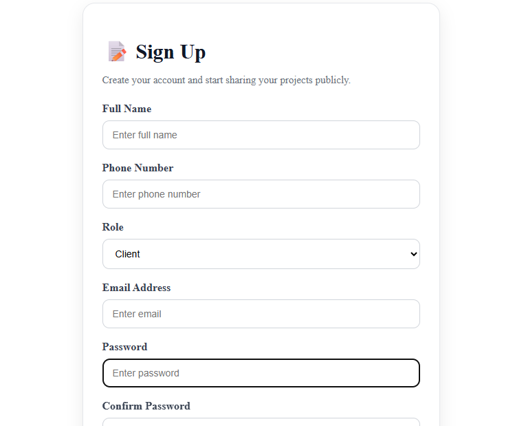
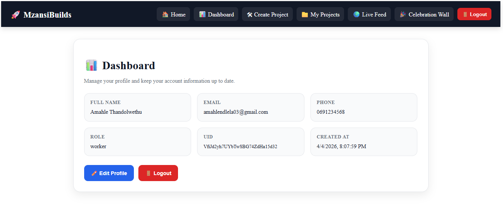
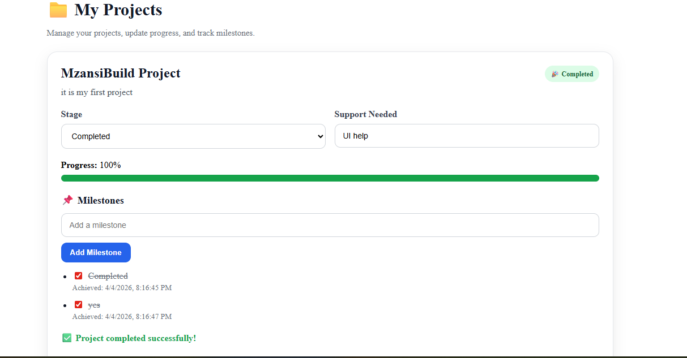
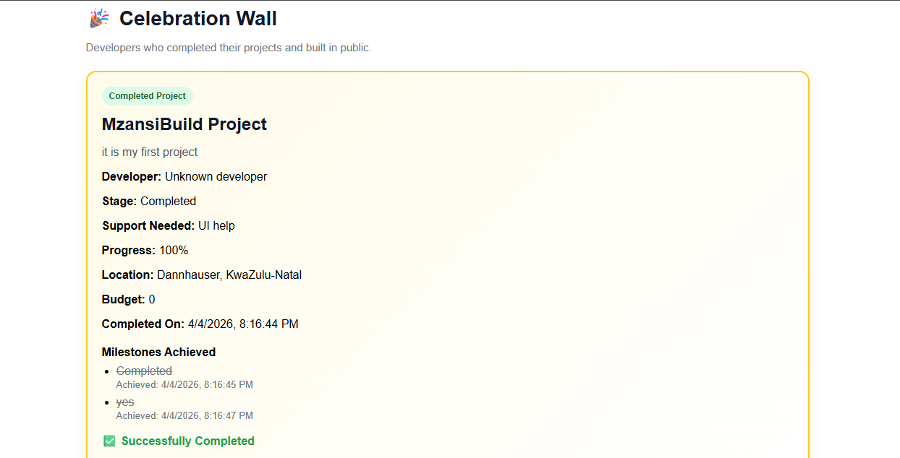
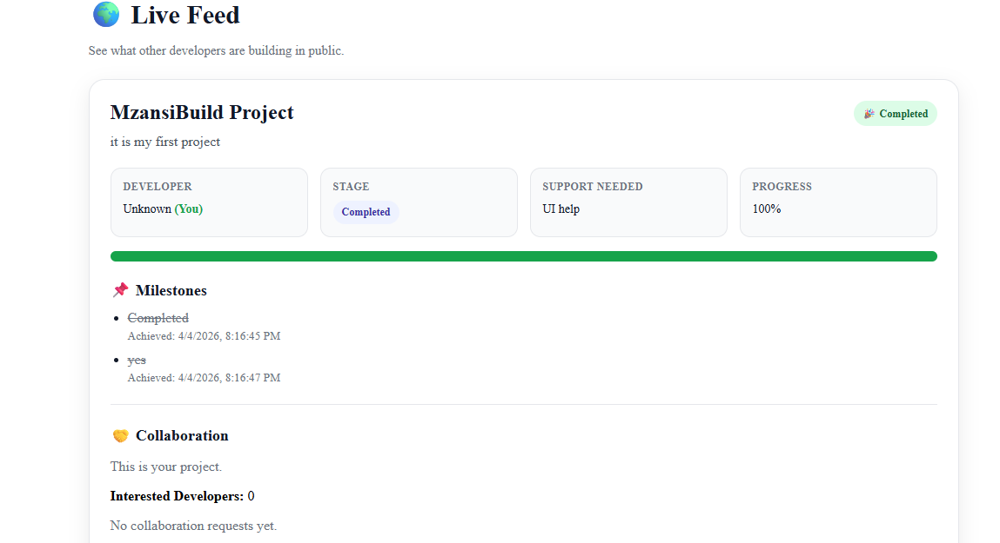

# 🏗️ MzansiBuilds

MzansiBuilds is a full-stack project management web application built with React and Firebase. It allows users to sign up, log in, create projects, track progress, update project stages, and engage with community-style features through a clean and responsive interface.

## 🚀 Features

- User authentication with Firebase
- Create and manage projects
- Update project progress, stage, and support
- Dashboard overview
- My Projects page
- Celebration Wall
- Live Feed
- Responsive user interface

## 🛠️ Tech Stack

- React
- Vite
- JavaScript
- Firebase Authentication
- Firebase Firestore
- CSS / custom styling

## 📸 Screenshots

### Home Page


### Login Page


### Sign Up Page


### Dashboard


### My Projects


### Celebration Wall


### Live Feed


## ⚙️ Installation

Clone the repository:

```bash
git clone https://github.com/Amahle003/MzansiBuilds.git
cd MzansiBuilds
